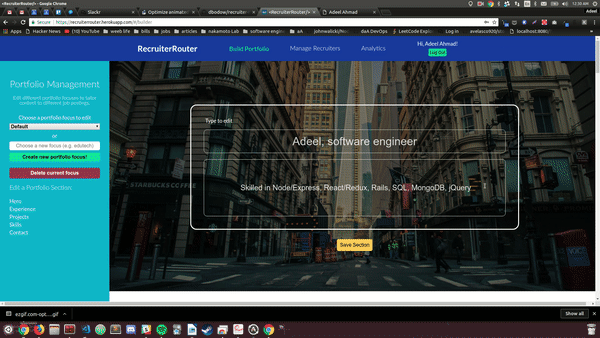

# Flex Project Proposal: 

## \< RecruiterRouter /\>, putting the closing tag on your Job Search (JS)

Full proposal: [wiki](https://github.com/dbodow/recruiter-router/wiki)

## Project Overview:

RecruiterRouter is a portfolio website template builder for users who wish to customize their portfolios to better target recruiters in their job search. Just as a candidate might customize his or her cover letter to respond to a job listing, users can customize their personal portfolios with RecruiterRouter to highlight various features of their skillset and background depending on the job to which they are applying.

Recruiter Router has 3 key features:

### Portfolio Builder

* Allows users to manage content for their portfolios and to create and delete tags to focus their content to different audiences.

### Link Management / Custom Portfolio Viewing

* Allows users to associate different portfolios with companies they are applying to, generate custom urls to embed in resumes and job application materials, and manage these associations and links.

### Analytics

* Tracks visits to custom links and allows users to view companies' engagement with their various portfolio campaigns.

# Technology Stack

RecruiterRouter is built on the MERN stack (MongoDB, Express.js, React.js, and Node.js). Given the document-like structure of a static web portfolio page, we took advantage of MongoDB's document database structure and patterns of denormalized state to fetch and write data easily.

Beyond this stack, we also used OAuth2 with the `Local` strategy for user authentication, and Chart.js for analytics display.

# User Testing

* The **Portfolio Builder** can be tested by creating an account and navigating to the **Portfolio Builder** link at the header.

* The **Portfolio Viewing** feature must be tested after building a portfolio. Navigate to **Manage Links** and type in a company name into the text input; then, select a tag from the drop-down menu. Click the submit button to generate a link. This link will display content inputted on the portfolio builder page, as well as a customized message to the company.

* The **Analytics** feature can be tested after generating a link: simply navigate to the link and the view will be tracked.

RecruiterRouter also offers a demo account with the following login that has been pre-filled with data and link follows:

Username: demouser
Password: password

A priority enhancement will be to place an automatic login for the demo user on the login window.

# Challenges

Given the scope of this project, our team faced several challenges:
* Designing the MongoDB schema and interacting with the database
  * Because we chose to use a denormalized structure to quickly and easily fetch and store portfolio data, we had to deal with issues in updating slices of the document state, in particular, updating arrays with the Mongoose `.set` feature.
  * Developing seeds for user data, which required writing several methods relying on Faker data.
* Building complex React-Redux components in the Portfolio builder that could track numerous potential changes to state as users updated their profiles.
* Converting a raw HTML website template into a Jade template which could be filled in with database portfolio data depending on tags. We are grateful to www.templatemo.com for providing a quality template for our starting point.
* Appropriately routing and tracking portfolio views with high granularity into different combinations of users, companies, and tags to associate.
* Learning Chart.js within 2 days' time for analytics display.
